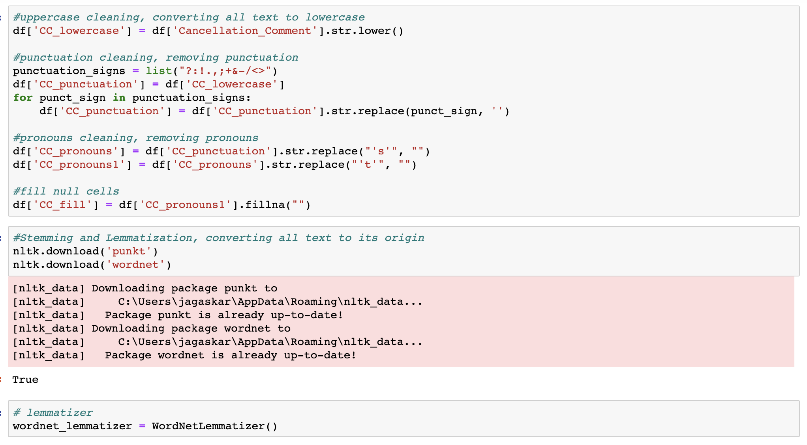
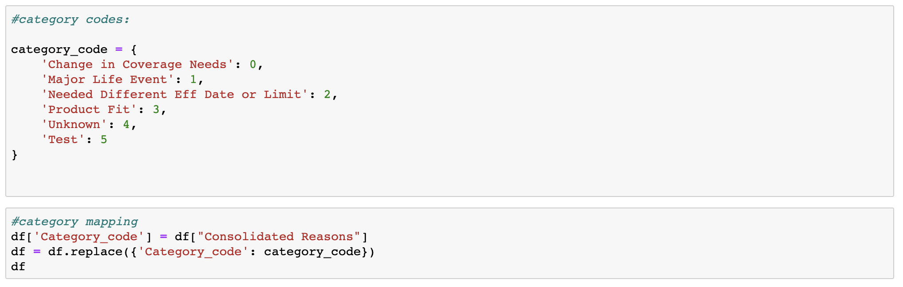
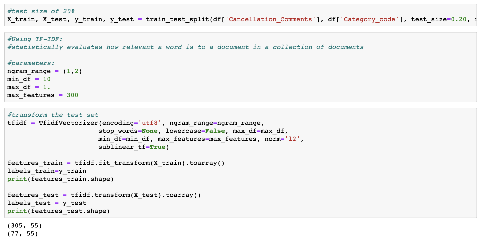
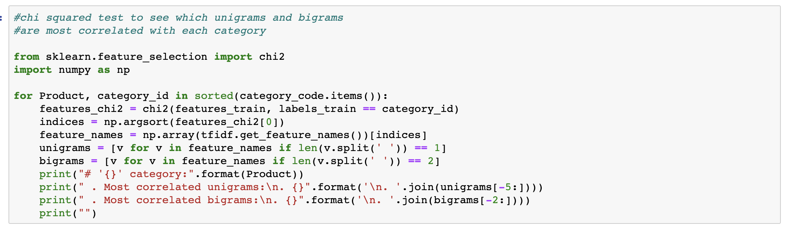
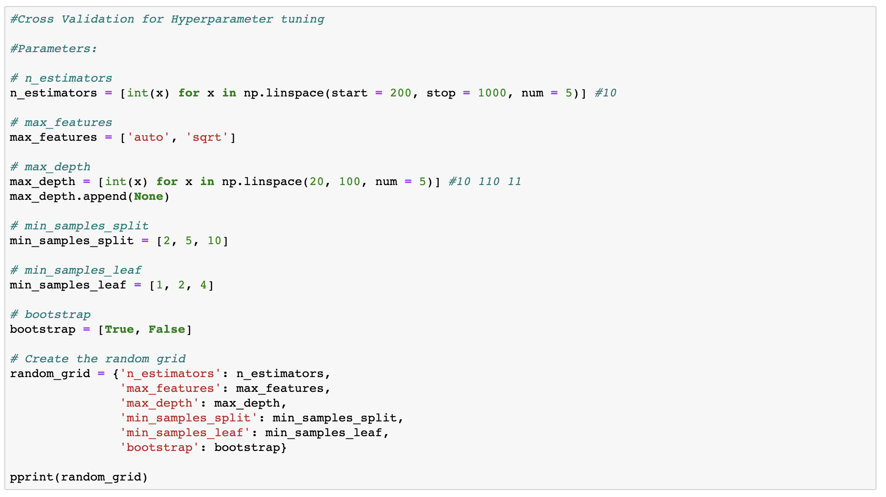
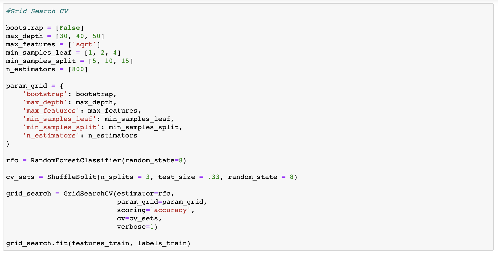
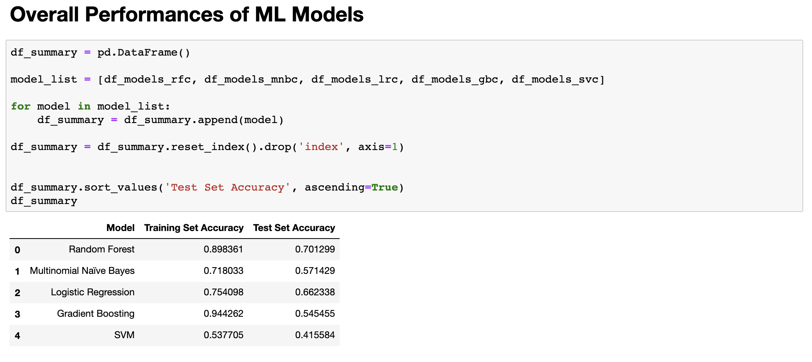
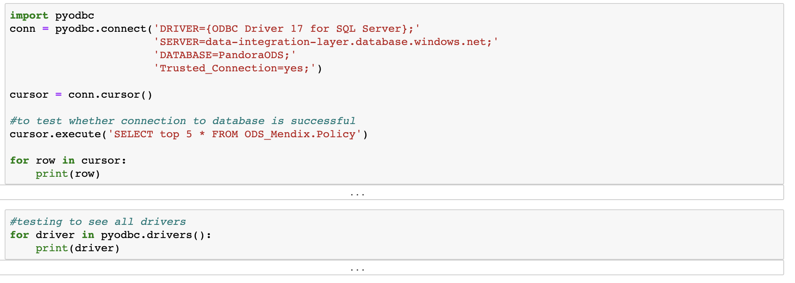
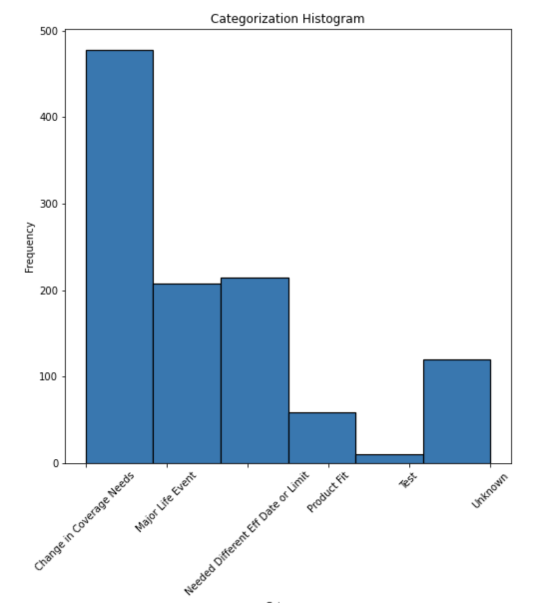
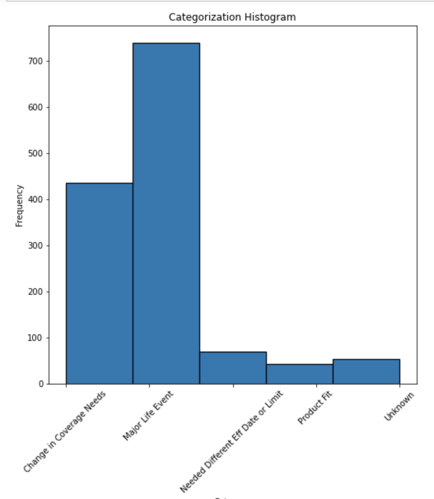

# Cancellation-comments
ML project during my Co-op at Berkshire Hathaway Specialty Insurance - Berxi
I am writing this document to detail my process and logic up to the deliverable, as code from the Jupyter Notebook file contains sensitive customer information. 

## Problem statement:
There are a significant number of policies being cancelled under the dropdown cancellation type 'Other'. It is difficult to understand why customers are cancelling without having to read through each individual comment.

## Use case:
To perform analysis on cancellation comments in order to categorize them into consolidated categories. We would then be able to identify trends that lead to cancellations and what drives our customers to select 'Other' and not an existing dropdown option. The aim is to not simply identify what the most prominent cancellation reasons are, but to gain information about cancellations as a whole and determine how to better serve our customer’s needs when selecting reasons so Product Specialists can take action to mitigate issues.

This deliverable is an executable python script running a supervised machine learning model on a set of cancellation comments for categorization and analysis. First, a random sample of cancellation comments under 'Other' were SQL queried from ODS Mendix table and manually labeled. The cancellation comments are written by a mix of both customers and Product Specialists. This dataset had to be a random sample to ignore any bias from cancellations during the COVID pandemic. 

In the labeling process, we got to the consolidated categories by sorting and labeling cancellation comments through 3 levels of classifications starting from lowest to a broader encapsulating category based on business decisions taken on each one. We also aimed to keep the number of categories to a minimum for better machine learning. Therefore, coming up with 6 pre-defined categories: Change in Coverage Needs, Major Life Event, Needed Different Eff Date or Limit, Product Fit, Test, or Unknown.

ggg

# 1. Data Cleaning

In the pre-processing stage, I cleaned the dataset with Pandas by converting all comments into lowercase, removing punctuations and pronouns, intoduced a word lemmatizer to shorten each word into it's base form, and removed stop words such as "the", "a" (NLTK Natural Language Toolkit)

I then mapped each consilidated category into numbers 0 to 5, and the dataset is ready for training. 

# 2. Model Split

The dataset was split into separate training and testing sets where 80% was reserved for training, and the remaining 20% for testing. 
These sets were also fit on a TFIDF vectorizer. 

Using the feature selection in Sci-kit learn, I extracted the most correlated bigrams and unigrams in each category. This was an important insight in understanding what are some of the common words associated with the categories. An important note here after revisiting, is that these bigrams and unigrams doesn't necessairly describe the customer's reasoning. We are interested in WHY the customer cancelled, not WHAT. For example, "Rewrite" may go into Change in Coverage Needs, but a rewrite doesn't tell us why the customer wanted a rewrite so we can't make the correct business decisions. It should instead go into Unknown. 

# 3. Feature Engineering

With Feature Engineering, I picked 5 machine learning algorithms that were applicable for this classification project. Random Forest, Naive Bayes, Logistic Regression, Gradient Boosting, and SVM were the 5 after researching their strengths and weaknesses. I initially introduced Randomized Cross Validation for Hyperparameter tuning in each machine learning algorithm. Once training features were fit on the base model, I compared the best parameters with results of Grid Search CV; extracting the model's overall training and testing set accuracy scores. 

Overall results table showed Random Forest having the best testing and training set accuracies and is the model I moved forward with. Gradient Boosting had the highest training set accuracy but a much lower training accuracy which indicated the model is overfitting. Linear SVM performed the worst out of the algorithms, in the future I could look into running the project again with Kernel SVM. 

I talk about what could have been done better and suggest improvements for future projects at the end of this project - Section 6, Future Improvements.  
Finally, all model's best features were stored as pickles to be accessed later. 

# 4. Running the algorithm with comments

I connected to the Operational Data Store database using pyodbc and wrote an SQL query to return all cancellation comments (not only 'Other'). The data wrangling & cleaning process was repeated as before and ran against my Random Forest model with best parameters. The following Histogram represents the model's classifications of number of comments in each category, for comments under 'Other':

Change in Coverage Needs is by far the most common reasoning as to why our customers were cancelling their policies. 

Now that comments in 'Other' are broken down into pre-defined consolidated categories, the same trained model was re-run on all cancellation comments. This step was done to illustrate any similarities between the current dropdown choices and the categories that can describe what's going on in our customer’s lives. It determines whether we should adjust our current options and asks whether customers are able to smoothly select a Cancellation Sub Type most closely relating to their provided comment. The following Histogram below represents the model's classifications of number of comments in each category, for comments in general across all dropdowns:

Running the model on Other cancellation comments, Change in Coverage Needs is the most common appearing category. The breakdown of these consolidated categories helps us understand the sentiment of customers who are selecting Other without going through every comment. This means that roughly 478 customers selecting Other either wanted a rewrite or did not want to renew. 215 of customers who are selecting Other had to cancel their policy to increase limits or change an effective date.

## 5. Conclusion

At this point, another problem statement arises: a large portion of customers are selecting the cancellation reason ‘Other’. We want to minimize these broader unknown reasons so that Product Specialists can better help in one of the pre-defined selections.

I performed an in-depth analysis by comparing the model's categorizations for 'Other' comments and comments in general. As an example, we found out that Major Life Event has many correlations with several different categories, this means that 4 of these current dropdowns are doing a good job at matching a customer’s comments with their intended cancellation reasoning.

Without giving out sensitive company information, I will be ending my discussion here. 
I submitted my analysis as a public document on Quip and the project was passed onto Product Specialists to help in their decision making process of adjusting the dropdowns. 

## 6. Future improvements

Looking back on this project, what I could have done better was on the evaluation stage as I chose a classification model. I simply chose the model with the best training and set accuracies overall. In future projects, I should be evaluating my models more thoroughly such as validating predictors with R-Squared scores, and including a confusion matrix to understand what categorizations my model got correct. I will have to spent more time improving the feature engineering, better tuning hyperparameters. Additionally, I am interested in learning more Natural Language Processing techniques so that I can tackle the unigrams and bigrams problem. How could I train my model to classify a comment with no context to unknown instead of to it's most correlated category?  

